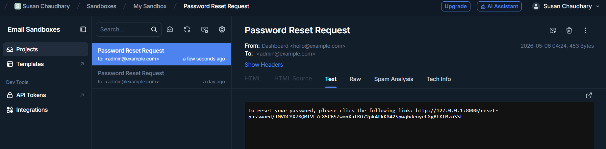
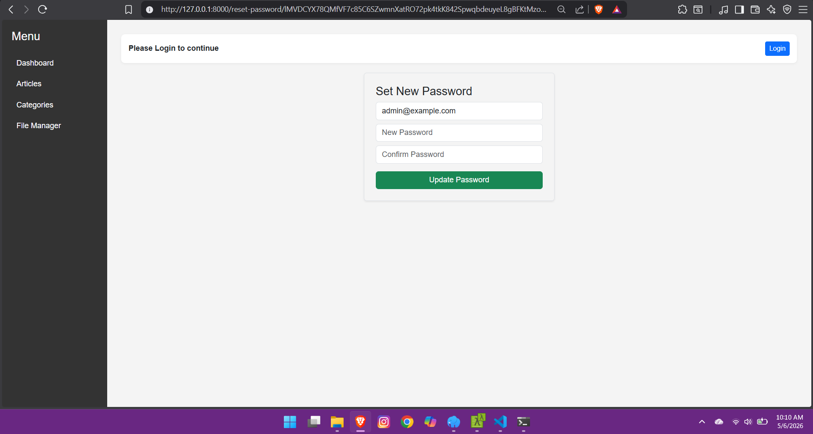
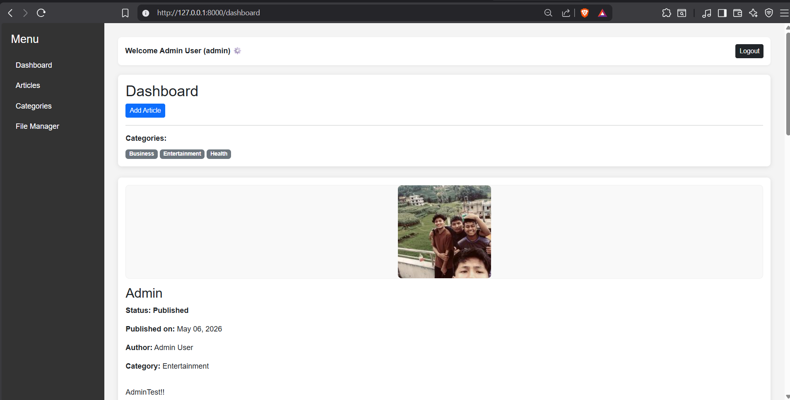
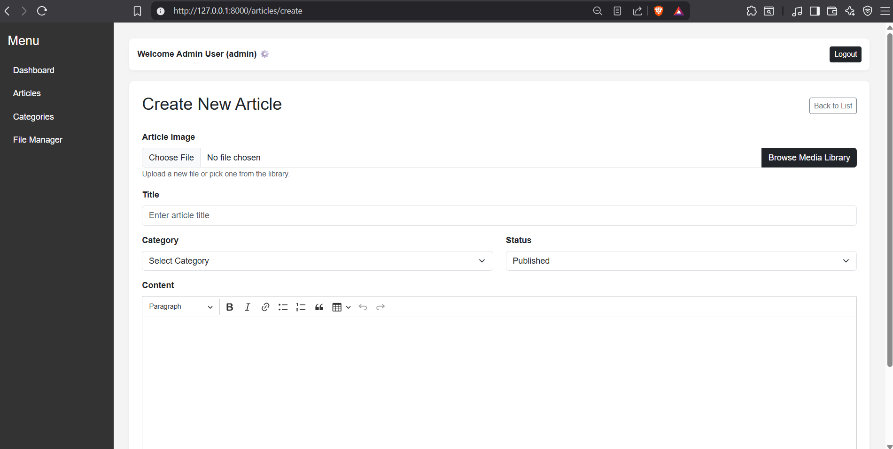
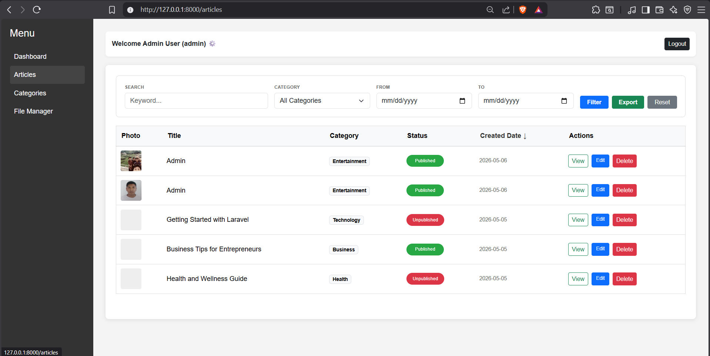
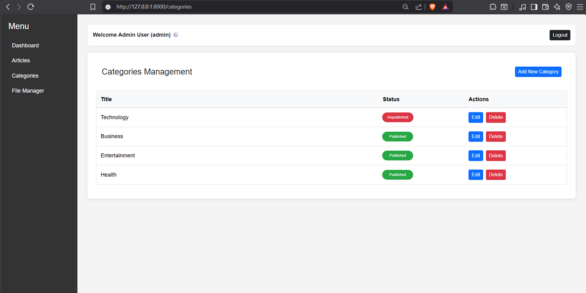
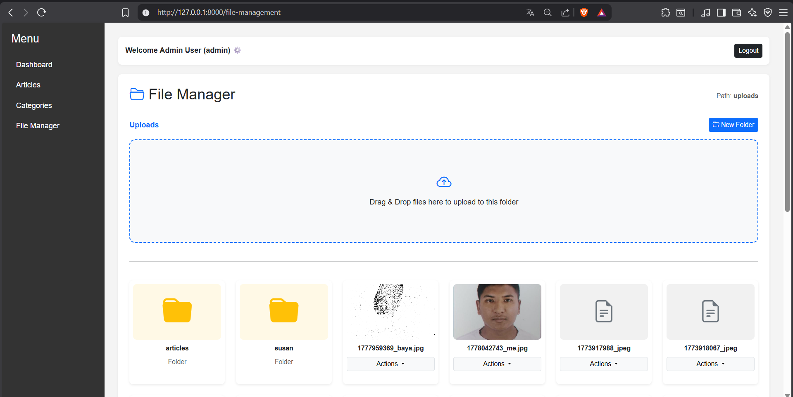
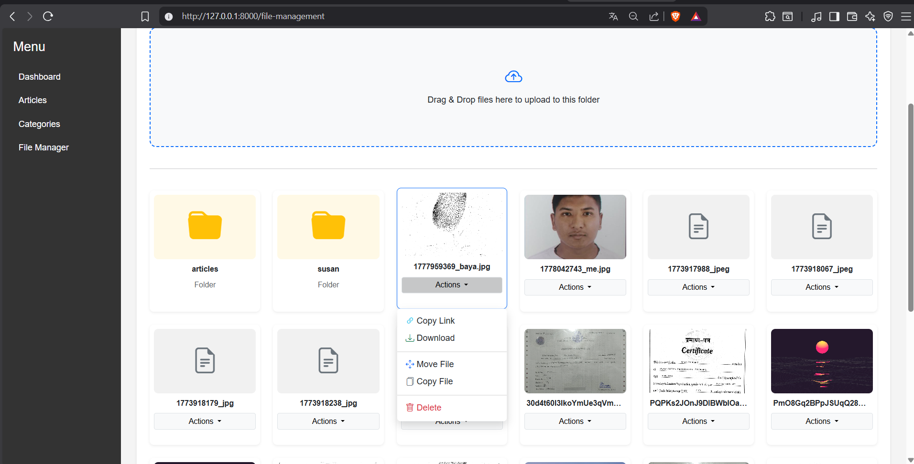
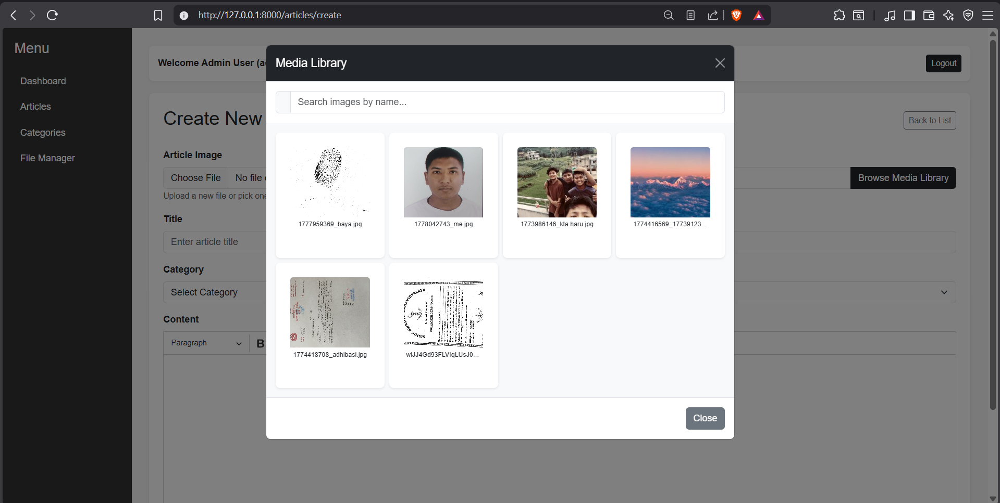
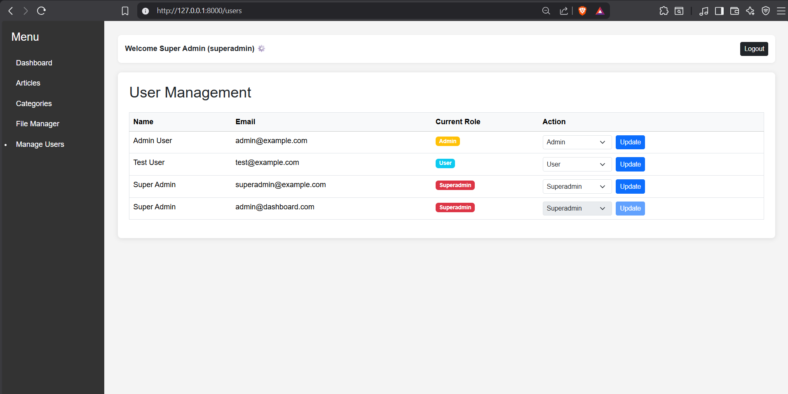

# Dashboard Laravel v12.54.1

This is the 10th version of my dashboard project. Throughout the development journey, each version has been enhanced by making significant changes in code flow, logic improvements, and adding new features. This version represents the culmination of continuous learning and refinement.

## Project Overview

Dashboard Laravel v12.54.1 is a comprehensive web application built with Laravel that provides functionality for managing articles, files, and categories. The application features a clean, intuitive interface with advanced file management capabilities, robust article administration, and user role management.

## Key Features

- User authentication and authorization with role management
- Article management system with CRUD operations and rich text editing
- CKEditor integration for rich content editing in article body
- Advanced file manager with drag-and-drop functionality and folder management
- Category management for articles with status toggling
- Image upload and processing with automatic resizing
- Article export functionality
- File upload, delete, move, and copy operations
- Media JSON API endpoint for file access
- Password reset and forgot password functionality
- User role and permission management
- Article and category status management (published/unpublished)
- Pagination for articles and categories
- Responsive dashboard interface
- Search and filtering capabilities
- User profile management

## Libraries and Technologies Used

### Core Framework
- Laravel 12.54.1
- PHP 8.3.30

### Frontend Libraries
- Image Intervention: Used for image resizing, optimization, and manipulation. This library handles all image processing tasks including thumbnail generation and quality adjustments on article uploads.
- Dropzone.js: Integrated for drag-and-drop file upload functionality in the file manager. Provides smooth user experience for file uploads with progress tracking.
- CKEditor: Integrated for rich text editing in article content (body field). Allows users to format text, add links, images, and other rich content elements.

### Additional Libraries
- MySQL for database management
- Blade templating engine for views
- Laravel Eloquent ORM for database operations

## Installation

1. Clone the repository
2. Install dependencies with composer install and npm install
3. Configure environment variables in .env file
4. Run database migrations
5. Build frontend assets
6. Start the development server

## Version History

### v1 (dashboard-laravel)
- User authentication: login, register, logout
- Article CRUD: create, edit, update, delete
- Inline category management (storeCategory inside ArticleController)
- Dynamic category filtering (showCategory)
- Dashboard view showing latest articles
- Auth middleware-protected routes

### v2 (dashboard-laravel-2-0)
- Separated CategoryController with full CRUD resource routes
- Admin views for articles and categories (admin/articles/*, admin/categories/*)
- Full Laravel resource routing (Route::resource) for both articles and categories
- User authorization tracking in DB (update_tables_for_authorization migration)

### v3 (dashboard-laravel-3-0)
- Article image upload support (add_image_to_articles migration + image field in forms)

### v4 (dashboard-laravel-4-0)
- Article detail/show view (admin/articles/show.blade.php)

### v5 (dashboard-laravel-5-0)
- Article export functionality (GET /articles/export route)

### v6 (dashboard-laravel-6-0)
- Image processing on upload using Intervention Image (auto-resizes/crops to 200x200)

### v7 (dashboard-laravel-7-0)
- Article status field (published/unpublished) with toggle route
- Category status field with toggle route
- Pagination added for articles and category listings

### v8 (dashboard-laravel-8-0)
- Status columns converted to boolean in DB (change_status_to_boolean migration)

### v9 (dashboard-laravel-9-0-File-Management)
- FileController with full file management: upload, delete, create folder, move, copy
- File management view (admin/files/index)
- Media JSON API endpoint (GET /api/media)

### v10 (dashboard-laravel-10-0-Admin-role)
- UserController with user listing and role management (admin/users/index)
- Forgot password and password reset flow (forgot/reset views and routes)
- password_resets table migration
- CKEditor integration for rich text editing in article content (body field)

## Screenshots

### Authentication

### Dashboard

### Articles Management

### Categories

### File Manager

### User Management & Roles

## Important Notes

Only users with SuperAdmin role have access to the user management navigation menu. Regular admin users will not see the "Manage Users" option in the navigation bar. The user management system is exclusively available for SuperAdmin accounts to maintain security and prevent unauthorized access to user role and permission management.

## Known Security Vulnerabilities and Learning Plan

As a cybersecurity enthusiast, I am actively learning about web application security. The following vulnerabilities have been identified in this version and will be fixed gradually as my knowledge and understanding of cybersecurity improves:

### Identified Vulnerabilities

1. Path Traversal Vulnerability: Potential unauthorized access to files outside intended directories through manipulated file paths.

2. Unrestricted File Upload: Lack of comprehensive file type and size validation allowing potentially malicious file uploads.

3. Cross-Site Scripting (XSS): User inputs and article content may not be properly sanitized, potentially allowing JavaScript injection. (**FIXED**)

4. Insufficient Authorization Checks: Missing verification to ensure users can only access their own content.

5. Missing Rate Limiting: No rate limiting implemented on login attempts, file uploads, and other endpoints vulnerable to brute force attacks.

6. Insecure Direct Object Reference (IDOR): File and article IDs may be predictable, allowing unauthorized access to other users' resources.

7. Missing Input Validation: Incomplete validation on form submissions for articles, files, and categories. (**FIXED**)

8. CSRF Protection: Potential gaps in Cross-Site Request Forgery protection on certain forms.

9. Session Management: Session timeout and security configurations may need enhancement.

10. Information Disclosure: Error messages and exceptions may reveal sensitive system information.

### Security Improvement Plan

I am committed to learning about and implementing proper security practices. Future versions will include:

- Implementation of proper input validation and sanitization
- Enhanced file upload security with whitelist validation
- Proper authorization checks on all protected routes
- Rate limiting on sensitive endpoints
- Security headers implementation
- Improved error handling to prevent information disclosure
- Regular security audits and testing
- Following OWASP Top 10 guidelines

As my cybersecurity knowledge grows, these vulnerabilities will be systematically identified and fixed in subsequent versions.

## 🔒 Security Improvements

This project implements progressive security hardening through daily vulnerability fixes.

### Day 1: Input Validation & XSS Prevention  (FIXED)
- **Type:** Cross-Site Scripting (XSS) & Improper Input Validation
- **Risk:** HIGH (CWE-79, OWASP A03:2021)
- **Status:** RESOLVED
- **Coverage:** ArticleController, CategoryController
- **Details:** See [docs/SECURITY_FIXES.md](docs/SECURITY_FIXES.md)

### Day 2: Unrestricted File Upload  (IN PROGRESS)
- **Type:** Unrestricted File Upload & Execution
- **Risk:** HIGH
- **Status:** IMPLEMENTATION PENDING
- **Coverage:** File handling, storage security
- **Details:** See [docs/SECURITY_FIXES.md](docs/SECURITY_FIXES.md)

## Requirements

- PHP 8.3.30 or higher
- Composer
- Node.js and npm
- MySQL 5.7 or higher
- Laravel 12.54.1

## License

This project is open source.

## Author

Susan Chaudhary

## Note

This project is part of continuous learning in full-stack web development and cybersecurity. Feedback and suggestions are welcome.